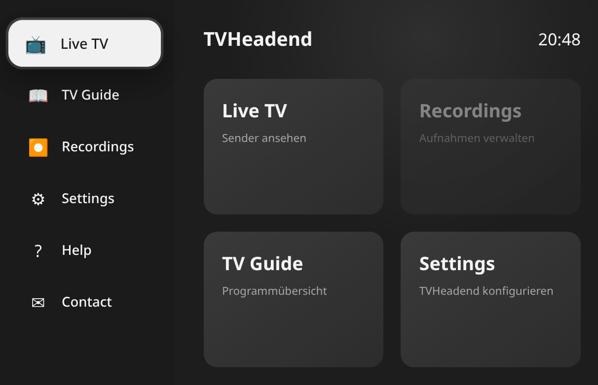
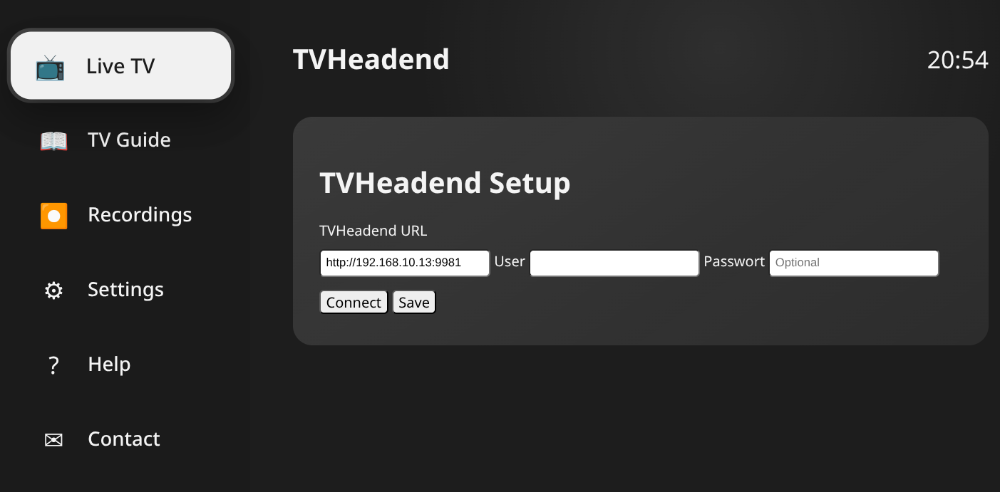
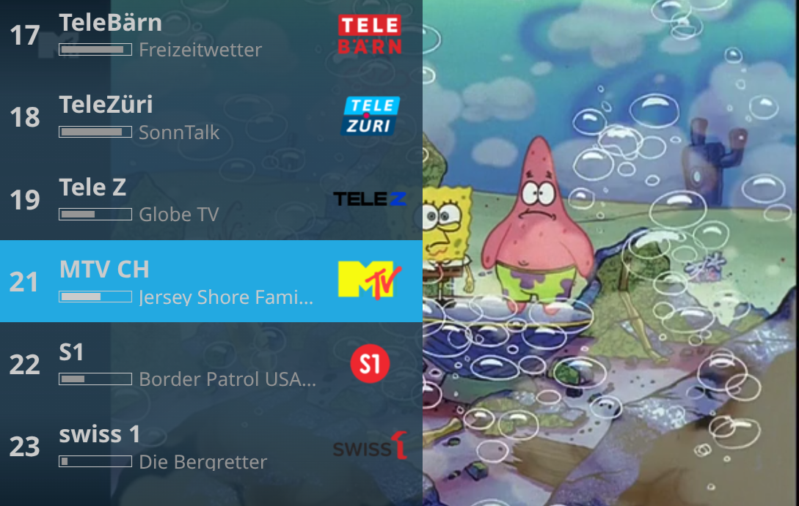
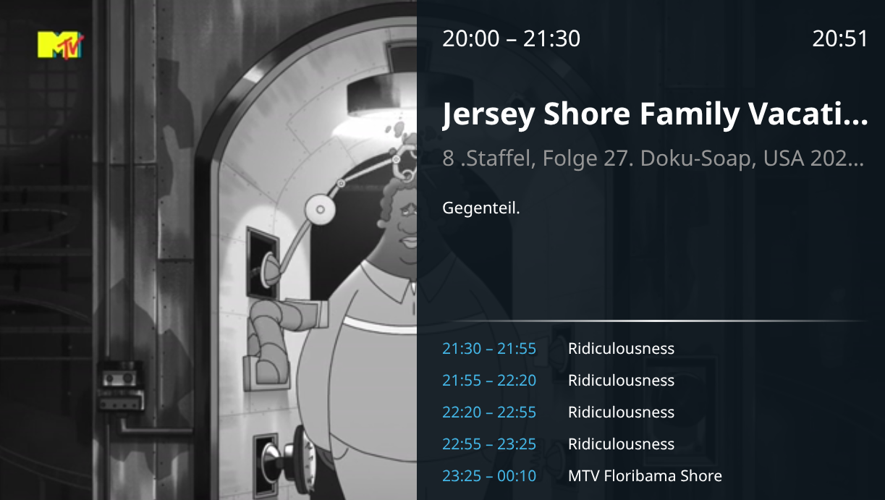
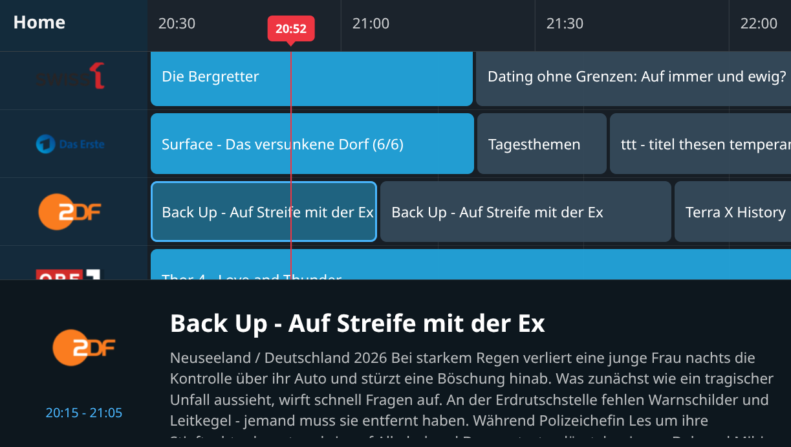

<!--p align="center">
  
</p-->

<h1 align="center">tvh-quick-gui</h1>

<p align="center">
A lightweight, blazing-fast modern Web UI and Player for Tvheadend <br> (FastAPI & Native JS)
</p>

## Features

- 📺 Live TV (TVHeadend)
- 📖 Interactive TV Guide (EPG)
- 📡 TVHeadend Channel API
- 🖥 Modern webOS-inspired interface
- ⌨ Keyboard navigation
- 🖱 Mouse navigation
- 📺 On Screen Display (OSD)
- ℹ Channel Information
- 🖼 Channel Logos
- ⚡ FastAPI backend
- 🎨 Responsive UI

---

## Screenshots

<table border="0">
  <tr>
    <td></td>
    <td></td>
  </tr>
    <tr>
    <td></td>
    <td></td>
  </tr>
      <tr>
    <td></td>
    <td></td>
  </tr>
</table>

---

## Requirements

- Python 3.11+
- FastAPI
- TVHeadend 4.3+
- Modern Browser

---

## Installation

```bash
git clone ...
cd tvh-quick-gui

python -m venv .venv
source .venv/bin/activate

pip install -r requirements.txt

cat <<< "TVH_STREAM_PROFILE=webtv-h264-aac-matroska" > .env

uvicorn app:app --reload --host 0.0.0.0 --port 8088
```

---

## Project Structure

See:

PROJECT_STRUCTURE.md

---

## Current Features

### Dashboard

- Status overview

### Live TV

- Live MPEG-TS playback
- Channel selection
- OSD
- Channel information

### TV Guide

- Timeline
- Current time indicator
- Program navigation
- Channel logos
- Detail view

---

## Roadmap

### v0.2.0

- TV Guide
- Branding
- README
- Logo
- Guide Navigation

### v0.3.0

- Favorites
- Search
- Recordings
- Settings

---


## Acknowledgements

tvh-quick-gui is developed by ixbuluk.

Architecture discussions, code reviews, debugging assistance,
and implementation support were created in collaboration
with ChatGPT (OpenAI).
